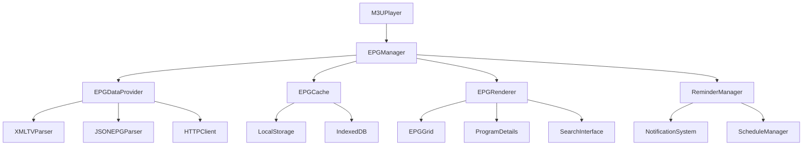

# Diseño del EPG (Electronic Program Guide)

## Visión General

El EPG se integrará como una nueva funcionalidad en el reproductor M3U existente, proporcionando una interfaz de grilla para mostrar la programación de canales IPTV. El diseño se basa en una arquitectura modular que se integra perfectamente con el sistema existente sin afectar la funcionalidad actual del reproductor.

## Arquitectura

### Arquitectura General



### Integración con el Sistema Existente

El EPG se integrará con la clase `M3UPlayer` existente mediante:

1. **Extensión de la clase principal**: Añadir métodos EPG a `M3UPlayer`
2. **Nuevos elementos UI**: Integrar componentes EPG en el HTML existente
3. **Gestión de eventos**: Conectar eventos EPG con el sistema de eventos actual
4. **Persistencia**: Utilizar el sistema de configuración existente para preferencias EPG

## Componentes e Interfaces

### 1. EPGManager (Gestor Principal)

**Responsabilidades:**
- Coordinar todas las operaciones EPG
- Gestionar el ciclo de vida de los datos EPG
- Integrar con el reproductor principal

**Interfaz:**
```javascript
class EPGManager {
    constructor(player)
    async initialize()
    async loadEPGData(channels)
    showEPGGrid()
    hideEPGGrid()
    getCurrentProgram(channelId)
    searchPrograms(query)
    setReminder(programId, channelId, startTime)
}
```

### 2. EPGDataProvider (Proveedor de Datos)

**Responsabilidades:**
- Obtener datos EPG de múltiples fuentes
- Parsear diferentes formatos (XMLTV, JSON)
- Gestionar la priorización de fuentes

**Fuentes de Datos Soportadas:**
- **XMLTV**: Formato estándar para datos EPG
- **JSON EPG**: Formato personalizado más ligero
- **Embedded EPG**: Datos incluidos en la playlist M3U
- **IPTV-ORG EPG**: Integración con la fuente IPTV-ORG existente

**Interfaz:**
```javascript
class EPGDataProvider {
    constructor(config)
    async fetchEPGData(channels)
    parseXMLTV(xmlData)
    parseJSONEPG(jsonData)
    extractEmbeddedEPG(m3uContent)
    prioritizeSources(sources)
}
```

### 3. EPGCache (Sistema de Caché)

**Responsabilidades:**
- Almacenar datos EPG localmente
- Gestionar expiración de datos
- Optimizar acceso a datos frecuentes

**Estrategia de Caché:**
- **Nivel 1**: Memoria (datos actuales y próximas 2 horas)
- **Nivel 2**: LocalStorage (datos del día actual)
- **Nivel 3**: IndexedDB (datos históricos y futuros hasta 7 días)

**Interfaz:**
```javascript
class EPGCache {
    constructor()
    async store(channelId, programs)
    async retrieve(channelId, timeRange)
    async cleanup()
    isExpired(timestamp)
    getStorageStats()
}
```

### 4. EPGRenderer (Renderizador de Interfaz)

**Responsabilidades:**
- Renderizar la grilla EPG
- Gestionar la navegación temporal
- Mostrar detalles de programas

**Componentes UI:**
- **EPGGrid**: Grilla principal con canales y programas
- **TimelineHeader**: Cabecera con indicadores de tiempo
- **ChannelList**: Lista lateral de canales
- **ProgramCard**: Tarjetas individuales de programas
- **ProgramDetails**: Modal con información detallada

**Interfaz:**
```javascript
class EPGRenderer {
    constructor(container)
    renderGrid(channels, programs, timeRange)
    updateCurrentTimeIndicator()
    showProgramDetails(program)
    highlightCurrentProgram(channelId, programId)
    scrollToTime(timestamp)
}
```

### 5. ReminderManager (Gestor de Recordatorios)

**Responsabilidades:**
- Gestionar recordatorios de programas
- Mostrar notificaciones
- Cambiar canales automáticamente

**Interfaz:**
```javascript
class ReminderManager {
    constructor(player)
    addReminder(programId, channelId, startTime)
    removeReminder(reminderId)
    checkReminders()
    showNotification(reminder)
    executeReminder(reminder)
}
```

## Modelos de Datos

### Programa EPG
```javascript
interface EPGProgram {
    id: string
    channelId: string
    title: string
    description?: string
    startTime: Date
    endTime: Date
    duration: number
    genre?: string[]
    rating?: string
    episode?: {
        season: number
        episode: number
        title?: string
    }
    credits?: {
        director?: string[]
        actor?: string[]
        writer?: string[]
    }
}
```

### Canal EPG
```javascript
interface EPGChannel {
    id: string
    name: string
    logo?: string
    group?: string
    programs: EPGProgram[]
    lastUpdated: Date
}
```

### Recordatorio
```javascript
interface Reminder {
    id: string
    programId: string
    channelId: string
    title: string
    startTime: Date
    notificationTime: Date
    status: 'pending' | 'notified' | 'executed' | 'cancelled'
}
```

## Integración con la UI Existente

### Nuevos Elementos HTML

```html
<!-- Botón EPG en la barra de herramientas -->
<button id="epgBtn" class="control-btn">📺 EPG</button>

<!-- Modal EPG -->
<div id="epgModal" class="modal epg-modal">
    <div class="epg-container">
        <div class="epg-header">
            <div class="epg-controls">
                <input type="text" id="epgSearch" placeholder="Buscar programas...">
                <button id="epgTodayBtn">Hoy</button>
                <button id="epgTomorrowBtn">Mañana</button>
            </div>
            <button id="closeEPG" class="close-btn">&times;</button>
        </div>
        <div class="epg-content">
            <div class="epg-timeline"></div>
            <div class="epg-grid-container">
                <div class="epg-channels"></div>
                <div class="epg-grid"></div>
            </div>
        </div>
    </div>
</div>

<!-- Indicador de programa actual -->
<div class="current-program-info">
    <span id="currentProgramTitle">Programa actual</span>
    <span id="currentProgramTime">20:00 - 21:00</span>
</div>
```

### Estilos CSS

Los estilos seguirán el tema oscuro existente con:
- Gradientes similares a los componentes actuales
- Colores consistentes con la paleta existente
- Animaciones suaves para transiciones
- Diseño responsive para diferentes tamaños de pantalla

## Gestión de Errores

### Estrategias de Manejo de Errores

1. **Datos EPG no disponibles**: Mostrar mensaje informativo, continuar con funcionalidad básica
2. **Error de red**: Usar datos cacheados, mostrar indicador de estado offline
3. **Datos corruptos**: Limpiar caché, reintentar descarga
4. **Memoria insuficiente**: Limpiar caché antiguo, reducir ventana de tiempo

### Logging y Monitoreo

```javascript
class EPGLogger {
    static logDataFetch(source, success, channelCount)
    static logCacheOperation(operation, size)
    static logUserInteraction(action, details)
    static logError(error, context)
}
```

## Estrategia de Testing

### Tests Unitarios

1. **EPGDataProvider**: Parseo de diferentes formatos
2. **EPGCache**: Operaciones de almacenamiento y recuperación
3. **EPGRenderer**: Renderizado de componentes
4. **ReminderManager**: Lógica de recordatorios

### Tests de Integración

1. **Flujo completo EPG**: Carga → Caché → Renderizado
2. **Integración con reproductor**: Cambio de canal desde EPG
3. **Persistencia**: Datos sobreviven a reinicios
4. **Rendimiento**: Tiempo de carga con grandes datasets

### Tests de UI

1. **Navegación**: Desplazamiento por grilla
2. **Búsqueda**: Filtrado de programas
3. **Recordatorios**: Creación y gestión
4. **Responsive**: Funcionamiento en diferentes tamaños

## Consideraciones de Rendimiento

### Optimizaciones

1. **Virtualización**: Solo renderizar programas visibles
2. **Lazy Loading**: Cargar datos según demanda
3. **Debouncing**: Optimizar búsqueda y navegación
4. **Web Workers**: Procesamiento de datos en background
5. **Compresión**: Comprimir datos en caché

### Métricas de Rendimiento

- Tiempo de carga inicial: < 2 segundos
- Tiempo de navegación: < 100ms
- Uso de memoria: < 50MB para 7 días de datos
- Tamaño de caché: < 10MB en disco

## Configuración y Personalización

### Configuraciones de Usuario

```javascript
interface EPGConfig {
    autoUpdate: boolean
    updateInterval: number // minutos
    cacheRetention: number // días
    defaultTimeRange: number // horas
    reminderAdvance: number // minutos
    dataSources: string[]
    theme: 'auto' | 'dark' | 'light'
}
```

### Configuraciones por Defecto

- Auto-actualización: Habilitada (30 minutos)
- Retención de caché: 7 días
- Rango temporal por defecto: 24 horas
- Aviso de recordatorio: 5 minutos
- Fuentes de datos: Auto-detección

## Seguridad y Privacidad

### Medidas de Seguridad

1. **Validación de datos**: Sanitizar datos EPG recibidos
2. **CORS**: Configurar correctamente para fuentes externas
3. **Rate limiting**: Limitar frecuencia de peticiones
4. **Caché seguro**: Evitar almacenar datos sensibles

### Privacidad

- No almacenar información personal del usuario
- Datos de visualización solo localmente
- Recordatorios almacenados localmente
- Opción de limpiar todos los datos EPG